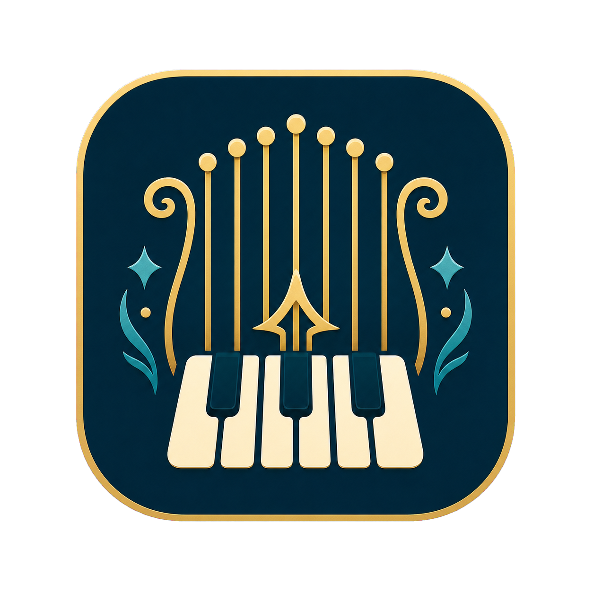
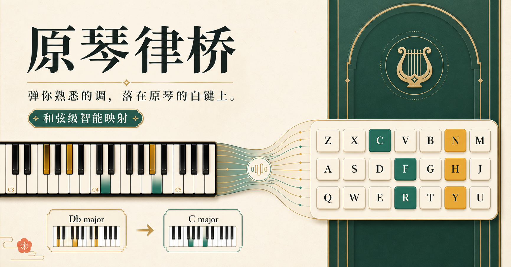

# MIDI2KEY for Genshin

<p align="center"></p>

[简体中文](README.zh-CN.md) · [Latest release](https://github.com/Oceannn233/MIDI2KEY-for-Genshin/releases/latest)

Turn a Windows MIDI digital piano into a visual, harmony-aware controller for Genshin Impact's 21-key instruments. The app transposes a selected source key into the playable C-major layout, resolves key collisions, shows every mapped note live, and sends game keys only after you explicitly enable output.



## Download

Open the [latest release](https://github.com/Oceannn233/MIDI2KEY-for-Genshin/releases/latest):

- `MIDI2KEY-for-Genshin-Setup-v1.0.0.exe` — recommended one-click Windows installer.
- `MIDI2KEY-for-Genshin.exe` — portable single-file app; no installation required.

Python, Node.js, and package installation are not required for either release asset. Windows may show a SmartScreen warning because community builds are not code-signed.

## Quick start

1. Close DAWs, old MIDI scripts, and browser tabs that previously opened Web MIDI.
2. Connect the digital piano by USB and start MIDI2KEY for Genshin.
3. Select the MIDI device, source tonic, mode, mapping strategy, and register.
4. Confirm the live visualization, then enable **Game output**.
5. Focus Genshin Impact and play. Use **Panic release** if any key remains held.

The controller binds only to `127.0.0.1`. MIDI events and settings are not sent to a cloud service.

## Mapping model

Genshin's lyre exposes three octaves of the C-major scale, mapped to `Z–M`, `A–J`, and `Q–U`. This app first converts scale degrees from the selected key/mode, then fits them into those 21 notes.

- **Harmony-aware** groups near-simultaneous notes, preserves chord shape, chooses one octave for the group, and assigns unique playable notes to avoid collisions.
- **Melody-first** chooses the nearest playable pitch independently, which feels immediate for single-note lines.
- **Strict diatonic** drops notes that cannot be represented without altering their pitch class.

Chromatic music cannot be represented perfectly on a diatonic 21-key instrument. The UI therefore exposes the compromise instead of hiding it: altered notes, collision avoidance, octave movement, and dropped notes are visible while playing.

## MIDI port troubleshooting

On Windows, a MIDI input can be exclusive. If the app reports `MidiInWinMM::openPort`, close every other program or browser tab using that keyboard, wait two seconds, then click **Reconnect**. The browser UI never opens Web MIDI; the local app is the sole device owner.

## Run from source

Requirements: Windows 10/11 and Python 3.11+.

```powershell
cd local_app
.\run-local.bat
```

The script creates an isolated environment and opens `http://127.0.0.1:17321`.

## Build the Windows release

```powershell
.\scripts\build-windows.ps1
```

Outputs are written to `release/windows/`. The build script bundles Python and all runtime dependencies with PyInstaller, then creates the installer with Inno Setup 6. Tagged GitHub pushes also run the included release workflow.

## Tests

```powershell
cd local_app
.\.venv\Scripts\python.exe -m unittest discover -s tests -v
cd ..
node --experimental-strip-types --test tests\mapping-algorithm.test.mjs
npm run build
```

## Project layout

- `local_app/` — MIDI engine, local server, desktop entry point, and product UI.
- `app/` — optional browser showcase/source download page.
- `scripts/` and `build/windows/` — repeatable Windows packaging.
- `.github/workflows/` — tagged release automation.

## Safety and scope

This project emits ordinary keyboard events. It does not inject into the game process, read game memory, or automate songs. Use it responsibly and review the applicable game rules yourself.

Released under the [MIT License](LICENSE).
